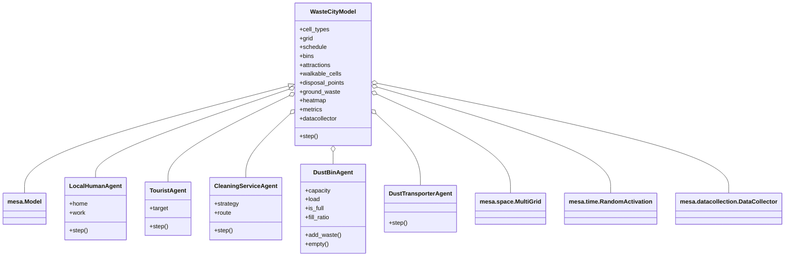

# Waste in the City — Agent-Based Model

> Final project for **Symbolic AI and Rule-based Agents** (Prof. Dr. Tatyana
> Ivanovska, OTH Amberg-Weiden, SS 2026). Project specification: slides
> 41–48 of `lecture5_1_SARA.pdf`.

[](https://www.python.org/)
[](https://mesa.readthedocs.io/)
[](#license)

A grid-based **Agent-Based Model (ABM)** that studies how **city structure,
movement patterns, bin placement, cleaning strategies, and transporter
frequency** affect waste accumulation in a city. The focus is the *emergent*
city-level waste distribution that arises from many interacting rule-based
agents, not the decision process of any single agent.

---

## Table of Contents

- [Features](#features)
- [Demo](#demo)
- [Project Structure](#project-structure)
- [Installation](#installation)
- [Quick Start](#quick-start)
- [Usage](#usage)
- [The City Grid](#the-city-grid)
- [Agents](#agents)
- [Cleaning Strategies](#cleaning-strategies)
- [Creative Extension](#creative-extension)
- [Metrics](#metrics)
- [Experiments](#experiments)
- [Configuration](#configuration)
- [Mapping to the Lecture Slides](#mapping-to-the-lecture-slides)
- [Notes & Caveats](#notes--caveats)
- [License](#license)

---

## Features

- Five distinct rule-based agent types (locals, tourists, cleaners, bins, transporters).
- Customisable city layouts via simple **ASCII maps**.
- Graph-search powered movement: **BFS**, **multi-target BFS**, and **A\*** with a Manhattan heuristic.
- **Mesa**-based scheduler and `DataCollector` for time-series metrics.
- Live **Matplotlib animation** + static snapshot + metrics plots.
- Built-in **experiment battery** that reproduces the slide-46 sweeps (cleaner strategy, tourist density, cleaning capacity).
- Mandatory **creative extension**: a decaying *waste-observation heatmap* and a heatmap-guided cleaning strategy.

---

## Demo

```bash
# Run simulation with default strategy
python run.py

# Run simulation with a specific cleaning strategy
python run.py --strategy heatmap

# Run all experiments (writes results to results/)
python run.py --experiments
```

All configuration (number of agents, steps, etc.) is set in `config.py`.
Metrics (CSV and PNG) are saved automatically to the `results/` folder after each run.

---

## Project Structure


See the class diagram below for code structure and relationships.



### File-by-File

| File | Purpose |
|------|---------|
| [`config.py`](config.py) | Every "lever" of the model in one place: grid size, agent population, waste probabilities, bin capacities, cleaner-strategy whitelist, heatmap decay/increment, and simulation length. |
| [`pathfinding.py`](pathfinding.py) | Self-contained graph-search module: `bfs_shortest_path`, `bfs_nearest` (multi-target BFS for *closest* bin / waste), `astar_path`. The graph is implicit over walkable grid cells. |
| [`agents.py`](agents.py) | The five `mesa.Agent` subclasses. Movement helpers shared between mobile agents are factored into a small `_MovingAgent` base. Every `step()` is heavily commented for the project defence. |
| [`city_model.py`](city_model.py) | The `WasteCityModel` (`mesa.Model`). Parses the ASCII layout, instantiates infrastructure (`B`, `C`, `D`), spawns the requested mix of mobile agents, holds the global ground-waste dictionary and heatmap, configures Mesa's `DataCollector`. |
| [`visualize.py`](visualize.py) | Pure Matplotlib visualisation. Renders static cells as a coloured background and overlays bins (with current load), waste piles, and mobile agents. Provides `animate()` for live runs and `plot_metrics()` for the time-series plots. |
| [`experiments.py`](experiments.py) | Implements the experiment battery from slide 46: cleaner-strategy sweep, tourist density, bin/cleaning capacity. Writes plots and CSVs into `results/`. |
| [`run.py`](run.py) | Friendly CLI. Switch strategy, population, steps, animation on/off, save GIFs, save metrics PNGs, or trigger the experiment battery with `--experiments`. |
| [`city_layouts/default.txt`](city_layouts/default.txt) | The default ASCII map. Edit it (or write a new one) and pass the path via `config.DEFAULT_LAYOUT_FILE` to study other city structures. |
| `results/` | Output folder for `--experiments`. Holds comparison plots (`*.png`) and the raw metric CSVs. |

---

## Installation

Requires **Python 3.10+**.

```bash
# 1. (Optional) create a virtual environment
python -m venv .venv
# Windows
.venv\Scripts\activate
# Linux / macOS
source .venv/bin/activate

# 2. Install dependencies
pip install -r requirements.txt
```

Dependencies are pinned in [`requirements.txt`](requirements.txt):

- `mesa>=2.1,<3.0`
- `numpy>=1.23`
- `pandas>=1.5`
- `matplotlib>=3.6`

> **Note:** Mesa 3 renamed several modules. If you upgrade you will need to
> migrate the imports in `agents.py` and `city_model.py`.

---

## Quick Start

```bash
# Default simulation (uses config.py for all parameters)
python run.py

# Run simulation with a specific cleaning strategy
python run.py --strategy heatmap

# Run all experiments (writes results to results/)
python run.py --experiments
```

---

## Usage

```bash
python run.py                # Run simulation with default strategy
python run.py --strategy heatmap   # Run simulation with heatmap strategy
python run.py --experiments        # Run all experiments (writes results to results/)
```

### Command-Line Options

| Option         | Type   | Default                        | Meaning                                 |
|---------------|--------|--------------------------------|-----------------------------------------|
| `--strategy`  | choice | `config.DEFAULT_CLEANER_STRATEGY` | Cleaner strategy to use.                |
| `--experiments` | flag | `False`                        | Run the experiment suite and exit.      |

All other options (number of agents, steps, etc.) are set in `config.py`.
Metrics (CSV and PNG) are saved automatically to the `results/` folder after each run.

## 1. Experiment mode has highest priority

If you use:

```bash
python run.py --experiments
```

then the program runs the experiment pipeline and exits. It does **not** run the normal animation/headless simulation path.

## 2. Animation mode is used if either of these is true

- you did **not** specify `--no-animate`
- or you specified `--save-animation`

That means this still uses animation mode:

```bash
python run.py --no-animate --save-animation out.gif
```

because saving an animation requires the animation pipeline.

## 3. Headless mode happens only when:

- `--no-animate` is set
- and `--save-animation` is **not** set
- and `--experiments` is **not** set

Example:

```bash
python run.py --no-animate
```

# Example Commands

## Default animated run

```bash
python run.py
```

## Run 500 steps without animation

```bash
python run.py --steps 500 --no-animate
```

## Save animation as GIF

```bash
python run.py --save-animation city.gif
```

## Use heatmap cleaner strategy

```bash
python run.py --strategy heatmap
```

## Run experiments

```bash
python run.py --experiments
```

## Headless run with saved metrics

```bash
python run.py --no-animate --save-metrics metrics.png
```

## Animated run with saved GIF and metrics

```bash
python run.py --save-animation city.gif --save-metrics metrics.png
```

---

## The City Grid

The world is an **ASCII map** (see [`city_layouts/default.txt`](city_layouts/default.txt)).
Each character is one cell:

| Symbol | Meaning |
|:------:|---------|
| `#` | Wall / building (blocks movement) |
| `.` | Street / walkable path |
| `P` | Public area (waste accumulates more easily here) |
| `A` | Attraction (tourists gravitate here) |
| `B` | Dust **bin** — small fixed infrastructure |
| `C` | Dust **container** — large fixed infrastructure |
| `D` | Disposal point at the city edge (transporter destination) |

Movement is restricted to the **4-connected grid graph**; agents rely on the
graph-search utilities in [`pathfinding.py`](pathfinding.py), satisfying the
*"use graph search algorithms where it makes sense"* requirement.

---

## Agents

| Class | Role |
|-------|------|
| `LocalHumanAgent` | Resident commuting *home → work → home* on a daily pattern. Drops a small amount of waste with probability `LOCAL_WASTE_PROB`; prefers using a nearby bin if one exists within `HUMAN_BIN_SEARCH_RADIUS` (BFS-based search). |
| `TouristAgent` | Visitor that drifts toward `A`-attractions. Less predictable (random walk 30 % of the time, occasionally picks a new target). Litters with the higher probability `TOURIST_WASTE_PROB`. |
| `CleaningServiceAgent` | Street cleaner driven by one of the four rule-based strategies in the next section. |
| `DustBinAgent` | Fixed bin (small) or container (large) with a capacity. Records overflow events and exposes a `fill_ratio` for metrics. |
| `DustTransporterAgent` | Truck-style agent that finds the nearest *sufficiently full* bin, empties it, and returns to the disposal point where the waste is permanently removed. |

---

## Cleaning Strategies

Configured via `--strategy` on the CLI, or `config.DEFAULT_CLEANER_STRATEGY`.

| Strategy | Behaviour |
|----------|-----------|
| `nearest_waste` | Multi-target BFS from the cleaner's cell to the closest known waste pile. |
| `random_patrol` | Picks any walkable neighbour each step — pure random walk. |
| `fixed_route`   | Cycles through a preset list of waypoints (bin cells by default). |
| `heatmap`       | **Creative extension.** Heads for the cell with the highest decaying-heatmap score. |

---

## Creative Extension

**Decaying waste-observation heatmap with a heatmap-guided cleaning strategy.**

Whenever the model registers ground waste at a cell it increments
`heatmap[y][x]` by `HEATMAP_INCREMENT`. Every simulation step the entire
heatmap is multiplied by `HEATMAP_DECAY` (`0.97` by default), so old
hotspots fade exponentially while persistent hotspots stay strong. The
`heatmap` cleaner then runs BFS toward `model.heatmap_argmax()` — the
strongest hotspot the city has *learned* about — instead of using the greedy
nearest-waste heuristic.

This adds **memory** and **prediction** to the otherwise reactive cleaning
service: cleaners can pre-position around chronic problem areas (typically
near the central plaza) even when individual pieces of waste have just been
produced and are not yet visible to the nearest-waste heuristic. See the
`compare_strategies_*` plots produced by `--experiments` for the effect.

---

## Metrics

The Mesa `DataCollector` samples the following each step:

| Metric | Meaning |
|--------|---------|
| `GroundWaste` | Total amount of litter currently on streets. |
| `OverflowingBins` | Count of bins/containers at or beyond capacity. |
| `AvgBinFill` | Mean fill ratio across all bins (proxy for "average waste per district"). |
| `WasteCleaned` | Cumulative waste collected by cleaning agents. |
| `WasteDisposed` | Cumulative waste delivered to the disposal point by transporters. |
| `WasteIntoBins` | Waste that humans put into bins (proxy for responsible disposal). |

Per-agent counters (`cleaned_units`, `bins_emptied`) are also available as
attributes for ad-hoc analysis.

---

## Experiments

Running `python run.py --experiments` (or `python experiments.py`) executes
the slide-46 experiment battery and writes the artefacts to `results/`:

- `compare_strategies_ground_waste.png`
- `compare_strategies_overflow.png`
- `tourists_ground_waste.png`
- `bin_density_overflow.png`
- Raw `*.csv` time series for every run.

---

## Configuration

All tunable parameters live in [`config.py`](config.py). Common knobs:

```python
GRID_WIDTH, GRID_HEIGHT       = 30, 30
NUM_LOCALS, NUM_TOURISTS      = 25, 10
NUM_CLEANERS, NUM_TRANSPORTERS = 3, 1
LOCAL_WASTE_PROB              = 0.05
TOURIST_WASTE_PROB            = 0.15
BIN_CAPACITY                  = 10
CONTAINER_CAPACITY            = 50
TRANSPORTER_FULL_THRESHOLD    = 0.7
HEATMAP_DECAY                 = 0.97
NUM_STEPS                     = 300
RANDOM_SEED                   = 42
```

---

## Mapping to the Lecture Slides

| Slide requirement | Where it lives |
|-------------------|----------------|
| Grid world with streets / buildings / public areas | [`city_layouts/default.txt`](city_layouts/default.txt), `city_model.WasteCityModel._scan_layout` |
| Local humans with daily patterns + occasional waste | `agents.LocalHumanAgent` |
| Tourists, less predictable, prefer attractions, more waste | `agents.TouristAgent` |
| Cleaning service with rule-based strategies | `agents.CleaningServiceAgent` + `config.CLEANER_STRATEGIES` |
| Bins / containers with capacity & overflow | `agents.DustBinAgent` |
| Dust transporters going to disposal | `agents.DustTransporterAgent` |
| Use of graph search | [`pathfinding.py`](pathfinding.py) (BFS / multi-target BFS / A\*) |
| Implementation in Mesa | `mesa.Model`, `mesa.Agent`, `mesa.space.MultiGrid`, scheduler, `DataCollector` |
| Experiments on slide 46 (strategies, density, …) | [`experiments.py`](experiments.py) + `run.py --experiments` |
| Statistics over simulation steps | `WasteCityModel.datacollector` + `visualize.plot_metrics` |
| Creative extension (slide 47) | Decaying heatmap + `heatmap` cleaner strategy |

---

## Notes & Caveats

- The default Mesa scheduler is `RandomActivation`, so per-step ordering varies. Reproducibility is achieved through `config.RANDOM_SEED` (passed to `model.random`).
- Visualisation uses Matplotlib (not Mesa's web server) to stay stable across Mesa minor releases.
- Pinned to **Mesa 2.x** in `requirements.txt`. Mesa 3 will require an import migration.

---

## License

This code is released under the [MIT License](https://opensource.org/licenses/MIT).
You are free to reuse and adapt it for educational purposes; please credit
the original assignment authors when doing so.
