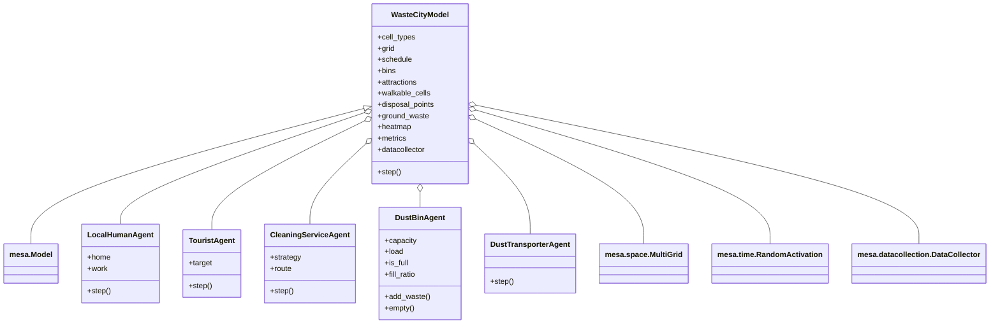

# Usage

## Run a simulation (default strategy)

```bash
python run.py
```

## Run a simulation with a specific cleaning strategy

```bash
python run.py --strategy heatmap
```

## Run all experiments (writes results to results/)

```bash
python run.py --experiments
```

- All configuration (number of agents, steps, etc.) is set in config.py.
- Metrics (CSV and PNG) are saved automatically to the results/ folder after each run.

# Project Structure

- agents.py: Agent classes
- city_model.py: Model logic
- config.py: All parameters
- experiments.py: Experiment batch logic
- pathfinding.py: BFS/A* search
- run.py: Entry point (CLI)
- visualize.py: Rendering/animation/metrics
- city_layouts/: ASCII city maps
- results/: Output metrics and plots

See the class diagram above for code structure and relationships.
