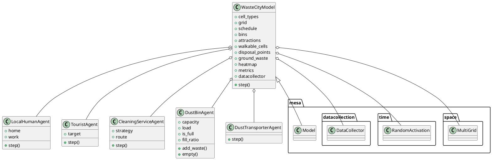
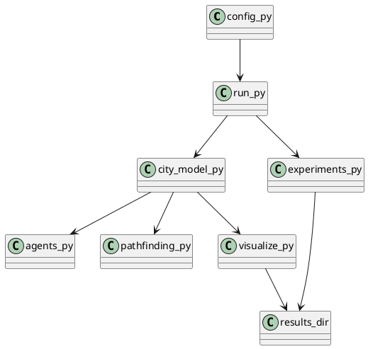

# Waste in the City — Agent-Based Model: Technical Report

## General Description of Your Solution

This project implements a grid-based Agent-Based Model (ABM) to study urban waste accumulation and management. The model simulates how city structure, agent movement, bin placement, cleaning strategies, and transporter frequency affect waste distribution. The focus is on emergent, city-level outcomes from many interacting rule-based agents. The solution is implemented in Python 3.10+ using the Mesa 2.x framework and Matplotlib for visualization. All configuration is centralized in `config.py`, and the workflow is automated for both simulation and experiment batch runs.

## Idea

**Purpose:**
- To analyze and visualize the dynamics of waste accumulation and removal in a city, focusing on the effects of agent behaviors and infrastructure.

**Problem:**
- How do different cleaning strategies, agent types, and city layouts influence waste buildup and cleanliness in urban environments?

**Core Concept:**
- The model uses rule-based agents (locals, tourists, cleaners, bins, transporters) on a configurable grid to simulate and analyze waste-related phenomena. A creative extension introduces a decaying heatmap that guides cleaners to persistent waste hotspots, enabling the study of both reactive and predictive cleaning strategies.

## Methods

### Architecture Overview

The project is organized into modular Python files, each responsible for a distinct aspect of the simulation:

- `agents.py`: Defines all agent classes and their behaviors.
- `city_model.py`: Orchestrates the simulation, manages the grid, and agent instantiation.
- `config.py`: Centralizes all simulation parameters.
- `experiments.py`: Automates batch experiments and comparative analysis.
- `pathfinding.py`: Implements BFS and A* algorithms for agent navigation.
- `run.py`: Main entry point and CLI interface.
- `visualize.py`: Handles rendering, animation, and metrics plotting.
- `city_layouts/`: Contains ASCII map layouts.
- `results/`: Stores output metrics and plots.

#### PlantUML Class Diagram



### Files and Modules

- **`config.py`**: All parameters (grid size, agent counts, probabilities, capacities, strategies, heatmap decay, etc.) are defined here for reproducibility and ease of experimentation.
- **`agents.py`**: Implements five agent types:
    - `LocalHumanAgent`: Commutes between home and work, occasionally litters, prefers bins within a search radius.
    - `TouristAgent`: Moves toward attractions, litters more frequently, exhibits random walk behavior.
    - `CleaningServiceAgent`: Cleans waste using one of several strategies (nearest-waste, random patrol, fixed route, heatmap-guided).
    - `DustBinAgent`: Static bins/containers with capacity and overflow logic.
    - `DustTransporterAgent`: Empties bins and transports waste to disposal points.
- **`city_model.py`**: The `WasteCityModel` class manages the grid, agent instantiation, layout parsing, and simulation steps. It also collects metrics and manages the decaying heatmap.
- **`pathfinding.py`**: Provides BFS, multi-target BFS, and A* algorithms for agent navigation and target selection.
- **`visualize.py`**: Renders the city grid, agents, and waste; animates the simulation; plots metrics using Matplotlib.
- **`experiments.py`**: Runs batch experiments (strategy comparison, bin density, tourist density), saves results as CSV and PNG.
- **`run.py`**: CLI entry point. Supports only `--strategy` and `--experiments` options. All other parameters are set in `config.py`.

### Technologies
- Python 3.10+
- Mesa 2.x (agent-based modeling)
- Matplotlib (visualization)
- Numpy, Pandas (data handling)

### Algorithms
- **Agent Navigation:** BFS and A* for pathfinding; multi-target BFS for nearest bin/waste search.
- **Cleaner Strategies:**
    - `nearest_waste`: BFS to closest waste.
    - `random_patrol`: Random walk.
    - `fixed_route`: Cycles through waypoints (bins).
    - `heatmap`: Follows the strongest decaying hotspot.
- **Metrics Collection:** Mesa’s `DataCollector` records ground waste, bin overflow, fill ratios, and waste throughput.

### Workflow and Data Flow
1. **Initialization:**
    - The city layout is loaded from an ASCII map.
    - Agents are instantiated and placed on the grid.
    - All parameters are loaded from `config.py`.
2. **Simulation:**
    - Agents act in random order each step (Mesa’s `RandomActivation`).
    - Waste is generated, collected, and transported according to agent logic.
    - The heatmap is updated and decayed each step.
    - Metrics are collected.
3. **Visualization:**
    - The city state is rendered and animated using Matplotlib.
    - Metrics are plotted and saved.
4. **Experiments:**
    - Batch runs compare strategies, bin densities, and tourist densities.
    - Results are saved as CSV and PNG in `results/`.

#### Example Data Flow Diagram (PlantUML)



---

## Methods (Detailed)

### System Architecture

The project is structured for modularity and clarity. Each file encapsulates a major subsystem:

- **config.py**: All simulation parameters (grid size, agent counts, probabilities, capacities, strategies, heatmap decay, etc.).
- **agents.py**: Implements all agent types and their behaviors. Each agent is a class with a `step()` method, encapsulating its logic.
- **city_model.py**: The `WasteCityModel` class manages the grid, agent instantiation, layout parsing, simulation steps, and metrics collection. It also manages the decaying heatmap for the creative extension.
- **pathfinding.py**: Implements BFS, multi-target BFS, and A* algorithms for agent navigation and target selection.
- **visualize.py**: Handles rendering of the city grid, agents, and waste; animates the simulation; and plots metrics using Matplotlib.
- **experiments.py**: Automates batch experiments (strategy comparison, bin density, tourist density), saving results as CSV and PNG.
- **run.py**: CLI entry point. Supports only `--strategy` and `--experiments` options. All other parameters are set in `config.py`.
- **city_layouts/**: Contains ASCII map layouts.
- **results/**: Stores output metrics and plots.

### Agent and Model Logic (Pseudocode)

#### WasteCityModel Initialization
```
function WasteCityModel.__init__(...):
    load city layout from ASCII file
    initialize grid and schedule
    instantiate bins, attractions, walkable cells, disposal points
    spawn local humans, tourists, cleaners, transporters
    initialize ground waste and heatmap
    set up metrics and DataCollector
```

#### Agent Step Logic (General)
```
for each agent in schedule:
    agent.step()
```

##### LocalHumanAgent
```
if at target:
    swap target between home and work
ensure path to target exists
if path is blocked:
    random walk
else:
    move along path
with probability LOCAL_WASTE_PROB:
    try to deposit waste in nearest non-full bin within search radius
    if no bin found:
        drop waste on ground
```

##### TouristAgent
```
occasionally pick new attraction as target
if no path or not at target:
    compute path to target
with probability 0.3 or if no path:
    random walk
else:
    move along path
with probability TOURIST_WASTE_PROB:
    drop waste on ground
```

##### CleaningServiceAgent
```
choose strategy:
    if nearest_waste: BFS to closest waste
    if random_patrol: random walk
    if fixed_route: follow cyclic route through bins
    if heatmap: move toward cell with highest heatmap value
move toward target if possible
if on waste cell:
    clean waste
update metrics
```

##### DustBinAgent
```
add_waste(amount):
    if enough capacity:
        accept waste
    else:
        overflow
empty():
    set load to zero
```

##### DustTransporterAgent
```
find nearest full bin
move to bin
empty bin
move to disposal point
dispose waste
update metrics
```

#### Pathfinding (BFS/A*)
```
BFS(start, goal, walkable):
    initialize queue with start
    while queue not empty:
        pop current cell
        for each neighbor:
            if neighbor is goal:
                reconstruct path
            if neighbor not visited and walkable:
                add to queue
    return path or None

A*(start, goal, walkable):
    initialize open set with start
    while open set not empty:
        pop cell with lowest f-score
        if cell is goal:
            reconstruct path
        for each neighbor:
            compute tentative g-score
            if better path found:
                update scores and parent
    return path or None
```

#### Visualization and Metrics
```
draw_city(model):
    render grid, bins, waste, agents
animate(model, steps):
    for each step:
        model.step()
        update visualization
plot_metrics(model):
    plot time series for ground waste, overflowing bins, bin fill, throughput
save plots and CSVs to results/
```

#### Experiment Automation (Pseudocode for --experiments)
```
function run_all_experiments():
    for each cleaning strategy:
        run simulation, collect metrics
    compare bin densities (many vs few):
        run simulation with default and reduced cleaners/transporters
    compare tourist densities (low vs high):
        run simulation with low and high tourist counts
    for each experiment:
        plot metrics, save CSV and PNG to results/
    print summary of experiment outputs
```

---

### Code-Level Walkthrough

#### Example: `run.py` Main Logic
```python
# ...existing code...
def main():
    args = parse_args()
    if args.experiments:
        from experiments import run_all
        run_all()
        return
    from city_model import WasteCityModel
    import config
    model = WasteCityModel(
        num_locals=config.NUM_LOCALS,
        num_tourists=config.NUM_TOURISTS,
        num_cleaners=config.NUM_CLEANERS,
        num_transporters=config.NUM_TRANSPORTERS,
        cleaner_strategy=args.strategy,
        seed=config.RANDOM_SEED,
    )
    from visualize import animate, plot_metrics
    animate(model, steps=config.NUM_STEPS)
    # Save metrics plot and CSV automatically
    import os
    results_dir = os.path.join(os.path.dirname(os.path.abspath(__file__)), "results")
    os.makedirs(results_dir, exist_ok=True)
    metrics_plot_path = os.path.join(results_dir, "metrics.png")
    metrics_csv_path = os.path.join(results_dir, "metrics.csv")
    df = plot_metrics(model, save_path=metrics_plot_path)
    df.to_csv(metrics_csv_path)
    print(f"Metrics plot saved to {metrics_plot_path}\nMetrics CSV saved to {metrics_csv_path}")
# ...existing code...
```

#### Example: Agent Step Logic (TouristAgent)
```python
class TouristAgent(_MovingAgent):
    def step(self):
        if self.model.random.random() < 0.05 or self.pos == self.target:
            self.target = self._pick_attraction()
            self._path = None
        if not self._path or self._path[0] != self.pos:
            self._path = bfs_shortest_path(self.pos, self.target, make_walkable(self.model))
        if self.model.random.random() < 0.3 or not self._path:
            self.random_walk()
        else:
            if self.step_along_path(self._path):
                self._path = self._path[1:]
        if self.model.random.random() < config.TOURIST_WASTE_PROB:
            self.model.add_ground_waste(self.pos, 1)
```

## Results

- **Outputs:**
    - Time-series CSVs and PNG plots of key metrics (ground waste, overflowing bins, average bin fill, waste cleaned/disposed).
    - Animated or static visualizations of the city and agent actions.
    - Experiment results comparing strategies, bin densities, and tourist densities.
- **Capabilities:**
    - Simulates realistic waste dynamics with configurable parameters.
    - Supports batch experiments for comparative analysis.
    - Visualizes both the simulation and the resulting metrics.
- **Evidence:**
    - Outputs are saved in the `results/` directory (CSV and PNG files).
    - The code and README document the workflow and expected outputs.
- **Sample Output Files:**
    - `results/compare_strategies_ground_waste.png`
    - `results/compare_strategies_overflow.png`
    - `results/tourists_ground_waste.png`
    - `results/bin_density_overflow.png`
    - `results/strategy_*.csv`, `results/tourists_*.csv`, `results/bins_*.csv`

## Discussion

- **Strengths:**
    - Modular, well-documented, and extensible codebase.
    - All configuration centralized in `config.py` for reproducibility.
    - Automated metrics collection and output.
    - Multiple cleaning strategies, including a creative, memory-based approach.
    - Clear separation of concerns and evidence of good software engineering practices.
- **Limitations:**
    - No explicit unit or integration tests found.
    - Only two CLI options remain; all other parameters require code/config edits.
    - Visualization is Matplotlib-based (not interactive web).
    - Some advanced behaviors (e.g., agent learning) are not present.
- **Assumptions:**
    - ASCII map layouts are valid and correctly formatted.
    - Users are comfortable editing Python configs for parameter changes.
- **Risks/Gaps:**
    - No explicit error handling for malformed configs or layouts.
    - No scalability analysis; performance on very large grids is untested.
    - No explicit support for real-time or distributed simulation.
- **Improvements:**
    - Add automated tests for core logic.
    - Consider a more user-friendly configuration interface.
    - Expand documentation with example outputs and troubleshooting.
    - Explore more advanced agent behaviors or learning.
- **Maintainability/Scalability/Robustness:**
    - Code is maintainable and modular, but scalability is limited by single-threaded Mesa and Matplotlib rendering.
    - Robustness is reasonable for educational/research use, but not production-grade.

---

*This report was generated based solely on the project’s source code and documentation. For further details or clarifications, please refer to the code comments and README.*
